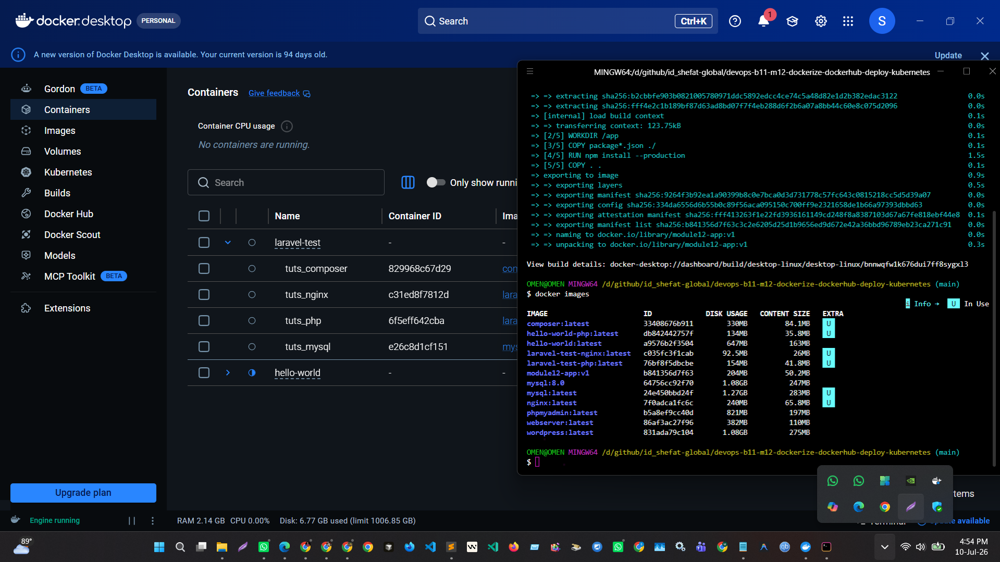
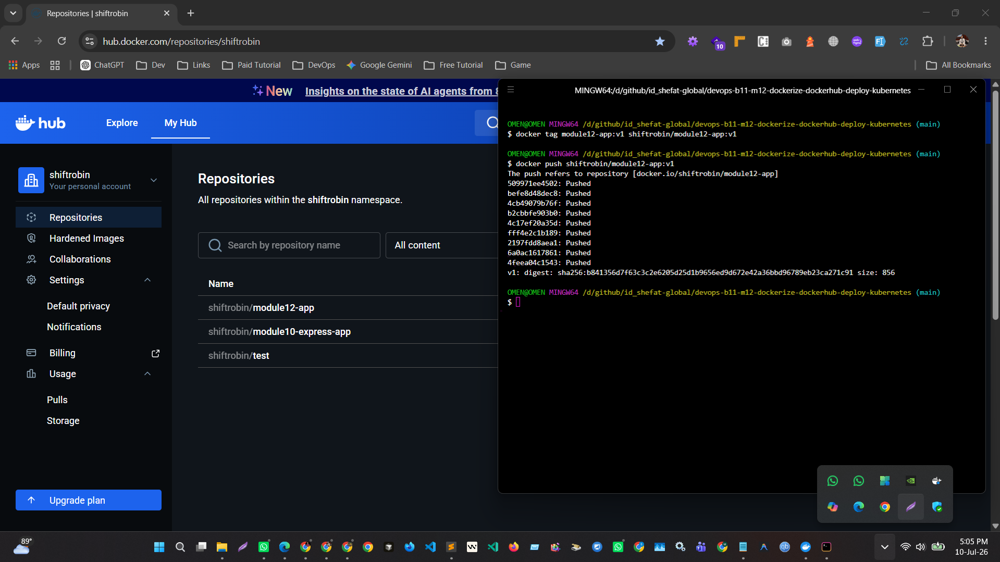
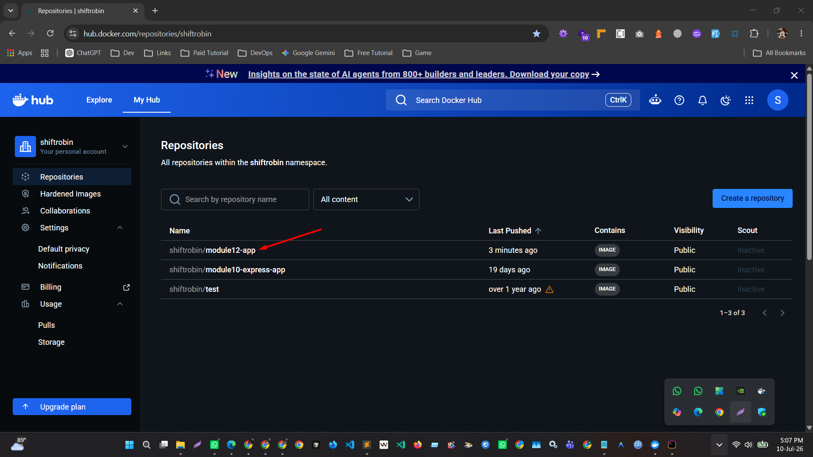
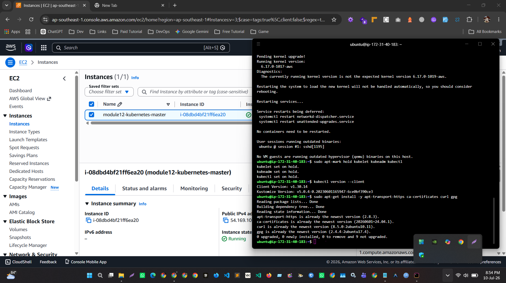
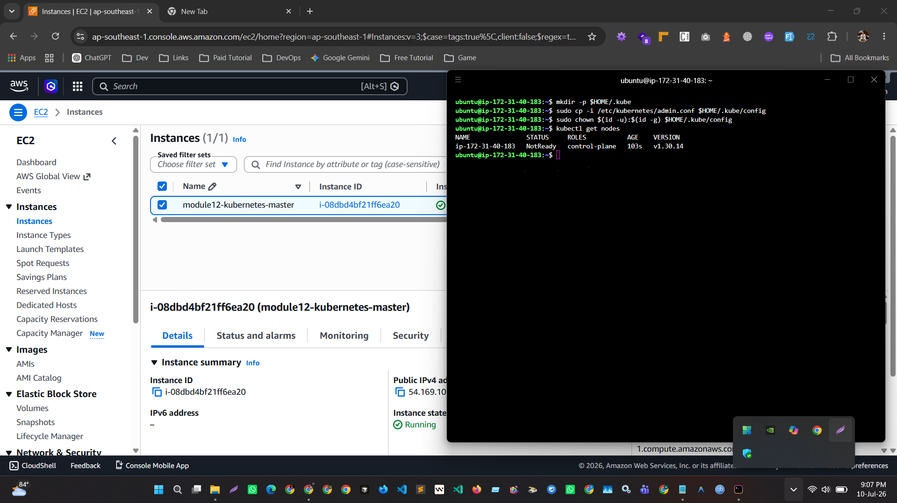
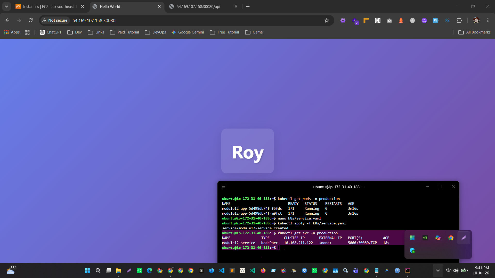
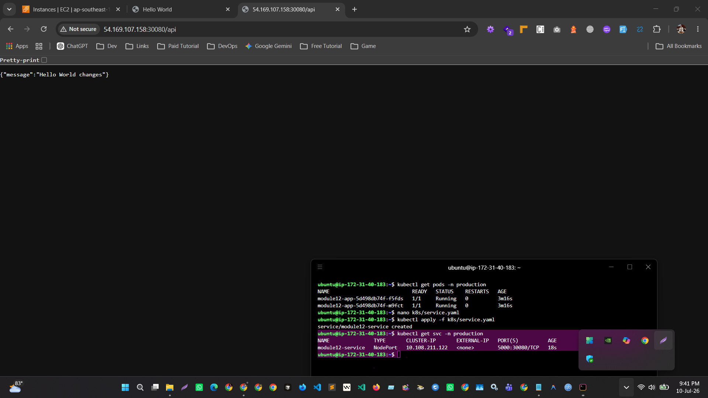

# Module 12 Assignment

## Dockerize, Push to Docker Hub & Deploy Application on Kubernetes

## Project Overview

This project demonstrates how I containerized a Node.js Express
application using Docker, pushed the Docker image to Docker Hub, created
a Kubernetes cluster on AWS EC2, and deployed the application into a
production namespace.

The main objective of this assignment was to understand the complete
deployment workflow:

-   Application containerization using Docker
-   Docker image management using Docker Hub
-   Kubernetes cluster setup using kubeadm
-   Kubernetes deployment and service configuration
-   External application access using NodePort

------------------------------------------------------------------------

# Technology Stack

-   Application: Node.js + Express.js
-   Container Platform: Docker
-   Image Registry: Docker Hub
-   Cloud Platform: AWS EC2
-   Kubernetes Version: v1.30.14
-   Kubernetes Tools:
    -   kubeadm
    -   kubelet
    -   kubectl
-   Operating System: Ubuntu 24.04 LTS

------------------------------------------------------------------------

# 1. Clone Repository and Prepare Application

I downloaded the provided GitHub repository and prepared it for Docker
deployment.

Repository:

https://github.com/roy35-909/Module-3-deployment

The application was checked and the required files were identified:

-   package.json
-   source code
-   Dockerfile

------------------------------------------------------------------------

# 2. Dockerize the Application

I created a Docker image using the following Dockerfile:

``` dockerfile
FROM node:20-alpine

WORKDIR /app

COPY package*.json ./

RUN npm install --production

COPY . .

EXPOSE 5000

ENV PORT=5000

CMD ["npm", "start"]
```

The Docker image was built successfully:

``` bash
docker build -t module12-app:v1 .
```

Docker image verification:

``` bash
docker images
```



------------------------------------------------------------------------

# 3. Push Image to Docker Hub

I tagged the image with my Docker Hub repository:

``` bash
docker tag module12-app:v1 shiftrobin/module12-app:v1
```

Then pushed it:

``` bash
docker push shiftrobin/module12-app:v1
```

Docker Hub repository:

https://hub.docker.com/r/shiftrobin/module12-app




------------------------------------------------------------------------

# 4. AWS EC2 Kubernetes Server Setup

I created an AWS EC2 instance:

-   Instance Type: t3.medium
-   OS: Ubuntu 24.04 LTS

Security group ports configured:

  Port          Purpose
  ------------- ---------------------------
  22            SSH
  6443          Kubernetes API Server
  30080         Application NodePort
  30000-32767   Kubernetes NodePort Range



------------------------------------------------------------------------

# 5. Install Kubernetes Components

Installed:

-   Docker
-   kubeadm
-   kubelet
-   kubectl

The Kubernetes cluster was initialized using:

``` bash
sudo kubeadm init --pod-network-cidr=10.244.0.0/16
```

Flannel network plugin was installed:

``` bash
kubectl apply -f https://github.com/flannel-io/flannel/releases/latest/download/kube-flannel.yml
```

The Kubernetes node became ready:

``` bash
kubectl get nodes
```

------------------------------------------------------------------------

# 6. Create Production Namespace

Created the required production namespace:

``` bash
kubectl create namespace production
```

------------------------------------------------------------------------

# 7. Kubernetes Deployment

Created Kubernetes deployment manifest:

File:

    k8s/deployment.yaml

The deployment uses my Docker Hub image:

    shiftrobin/module12-app:v1

The application was deployed:

``` bash
kubectl apply -f k8s/deployment.yaml
```

Two replicas were configured.

Verification:

``` bash
kubectl get pods -n production
```



------------------------------------------------------------------------

# 8. Kubernetes Service

Created NodePort service:

File:

    k8s/service.yaml

Applied service:

``` bash
kubectl apply -f k8s/service.yaml
```

Service verification:

``` bash
kubectl get svc -n production
```

NodePort:

    5000:30080/TCP

------------------------------------------------------------------------

# 9. Application Verification

The application was successfully accessed through:

    http://54.169.107.158:30080

API testing:

    http://54.169.107.158:30080/api

Response:

``` json
{
  "message": "Hello World changes"
}
```



------------------------------------------------------------------------

# Kubernetes Deployment Structure

    project
    │
    ├── Dockerfile
    │
    ├── k8s
    │   ├── deployment.yaml
    │   └── service.yaml
    │
    └── screenshots

------------------------------------------------------------------------

# Final Outcome

The assignment was completed successfully.

The application was:

-   Dockerized
-   Uploaded to Docker Hub
-   Deployed on AWS Kubernetes cluster
-   Running inside production namespace
-   Exposed externally through NodePort
